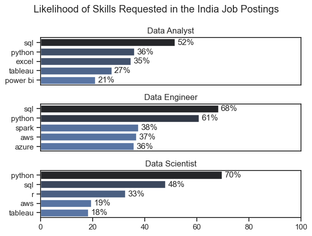
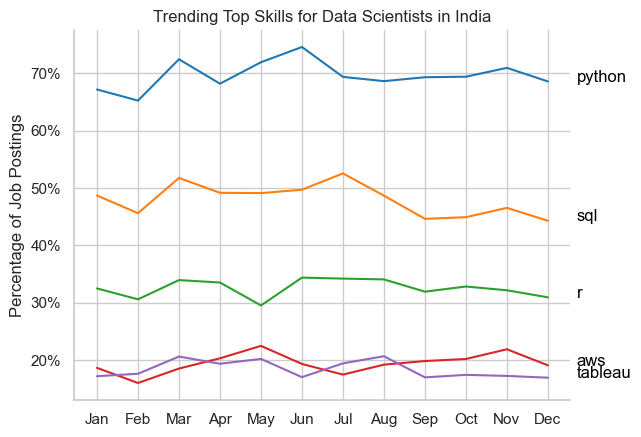
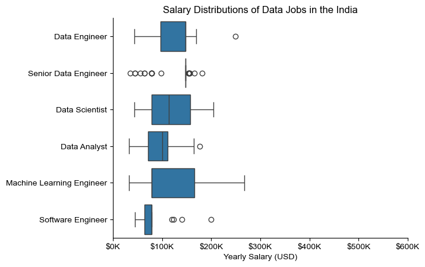
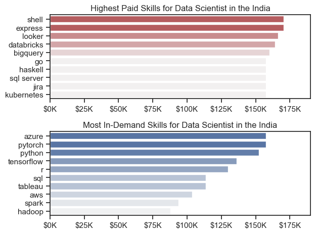
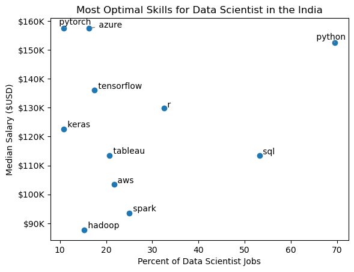
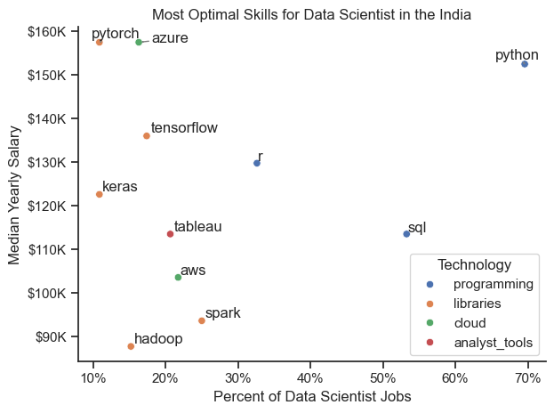

# Overview

Welcome to my analysis of the data job market, focusing on data Scientist roles. This project was created out of a desire to navigate and understand the job market more effectively. It delves into the top-paying and in-demand skills to help find optimal job opportunities for data Scientist.

The data sourced from [Luke Barousse's Python Course](https://lukebarousse.com/python) which provides a foundation for my analysis, containing detailed information on job titles, salaries, locations, and essential skills. Through a series of Python scripts, I explore key questions such as the most demanded skills, salary trends, and the intersection of demand and salary in data Scientist.

# The Questions

Below are the questions I want to answer in my project:

1. What are the skills most in demand for the top 3 most popular data roles?
2. How are in-demand skills trending for Data Scientist?
3. How well do jobs and skills pay for Data Scientist?
4. What are the optimal skills for Data Scientist to learn? (High Demand AND High Paying) 

# Tools I Used

For my deep dive into the data Scientist job market, I harnessed the power of several key tools:

- **Python:** The backbone of my analysis, allowing me to analyze the data and find critical insights.I also used the following Python libraries:
    - **Pandas Library:** This was used to analyze the data. 
    - **Matplotlib Library:** I visualized the data.
    - **Seaborn Library:** Helped me create more advanced visuals. 
- **Jupyter Notebooks:** The tool I used to run my Python scripts which let me easily include my notes and analysis.
- **Visual Studio Code:** My go-to for executing my Python scripts.
- **Git & GitHub:** Essential for version control and sharing my Python code and analysis, ensuring collaboration and project tracking.

# Data Preparation and Cleanup

This section outlines the steps taken to prepare the data for analysis, ensuring accuracy and usability.

## Import & Clean Up Data

I start by importing necessary libraries and loading the dataset, followed by initial data cleaning tasks to ensure data quality.

```python
# Importing Libraries
import ast
import pandas as pd
import seaborn as sns
from datasets import load_dataset
import matplotlib.pyplot as plt  

# Loading Data
dataset = load_dataset('lukebarousse/data_jobs')
df = dataset['train'].to_pandas()

# Data Cleanup
df['job_posted_date'] = pd.to_datetime(df['job_posted_date'])
df['job_skills'] = df['job_skills'].apply(lambda x: ast.literal_eval(x) if pd.notna(x) else x)
```

## Filter IND Jobs

To focus my analysis on the INDIA job market, I apply filters to the dataset, narrowing down to roles based in the India.

```python
df_IND = df[df['job_country'] == 'India']

```

# The Analysis

Each Jupyter notebook for this project aimed at investigating specific aspects of the data job market. Here’s how I approached each question:

## 1. What are the most demanded skills for the top 3 most popular data roles?

To find the most demanded skills for the top 3 most popular data roles. I filtered out those positions by which ones were the most popular, and got the top 5 skills for these top 3 roles. This query highlights the most popular job titles and their top skills, showing which skills I should pay attention to depending on the role I'm targeting. 

View my notebook with detailed steps here: [2-Skills_Demand](2-Skills_Demand.ipynb).

### Visualize Data

```python
fig, ax = plt.subplots(len(job_title),1)

sns.set_theme(style='ticks')

for i,title in enumerate(job_title):
    df_plot = df_skills_pct[ df_skills_pct['job_title_short'] == title].head(5)
    sns.barplot(data = df_plot, x ='skills_pct',y='job_skills',ax = ax[i], hue = 'skill_count', palette='dark:b_r',legend=False)

plt.show()
```

### Results



*Bar graph visualizing the salary for the top 3 data roles and their top 5 skills associated with each.*

### Insights:
- SQL is the most in-demand skill for Data Analysts (52%) and Data Engineers (68%), making SQL a critical skill across data roles.
- Python is highly important for Data Scientists (70%) and Data Engineers (61%), highlighting its strong demand for advanced data and machine learning work.
- Data Analysts require a broader mix of tools, with Excel (35%), Tableau (27%), and Power BI (21%) also appearing frequently alongside SQL and Python.
- Cloud technologies are particularly relevant for Data Engineers, with AWS (37%) and Azure (36%) showing strong demand.
- The required skill set varies by role: Data Analysts focus more on SQL, Excel, and BI tools, while Data Engineers emphasize SQL, Python, Spark, and cloud platforms, and Data Scientists prioritize Python, SQL, and R.

## 2. How are in-demand skills trending for Data Scientists?

To find how skills are trending in 2023 for Data Scientist, I filtered data Scientist positions and grouped the skills by the month of the job postings. This got me the top 5 skills of data Scientist by month, showing how popular skills were throughout 2023.

View my notebook with detailed steps here: [3-Skills_Trends](3-Skills_Trends.ipynb).

### Visualize Data

```python

from matplotlib.ticker import PercentFormatter

df_plot = df_DS_IND_pivot_pct.iloc[:, :5]
sns.lineplot(data=df_plot, dashes=False, legend='full', palette='tab10')

plt.gca().yaxis.set_major_formatter(PercentFormatter(decimals=0))

plt.show()

```


### Results

  
*Bar graph visualizing the trending top skills for data Scientiat in the IND in 2023.*

### Insights:

- Python consistently ranks as the most in-demand skill, staying around 65–75% of Data Scientist job postings throughout the year and peaking at approximately 75% in June.
- SQL is the second most requested skill, generally appearing in 44–52% of postings, with its highest point around 52% in July.
- R maintains steady demand, remaining around 30–34% throughout the year, showing consistent relevance for Data Science roles.
- AWS and Tableau have relatively lower demand, both staying mostly within the 17–22% range, compared with Python, SQL, and R.
- Skill demand fluctuates month to month, but the overall ranking remains stable: Python → SQL → R → AWS/Tableau. This suggests that Python and SQL should be prioritized when preparing for Data Scientist roles.

## 3. How well do jobs and skills pay for Data Scientist?

To identify the highest-paying roles and skills, I only got jobs in the India and looked at their median salary. But first I looked at the salary distributions of common data jobs like Data Scientist, Data Engineer, and Data Analyst, to get an idea of which jobs are paid the most. 

View my notebook with detailed steps here: [4-Salary_Analysis](4-Salary_Analysis.ipynb).

#### Visualize Data 

```python
sns.boxplot(data=df_IND_top6, x='salary_year_avg', y='job_title_short', order=job_order)

ticks_x = plt.FuncFormatter(lambda y, pos: f'${int(y/1000)}K')
plt.gca().xaxis.set_major_formatter(ticks_x)
plt.show()

```
#### Results

  
*Box plot visualizing the salary distributions for the top 6 data job titles.*

#### Insights

- Data Scientist and Machine Learning Engineer have relatively wide salary distributions, indicating greater variation in pay across these roles.
- Data Engineer shows a relatively high salary range, with a high-paying outlier around $250K.
- Senior Data Engineer has an unusual pattern with many outliers, particularly on the lower side and a few on the higher side, suggesting significant variation in reported salaries.
- Data Analyst has a comparatively lower and narrower salary distribution, with most salaries concentrated around the $80K–$110K range.
- Software Engineer has the lowest central salary range among the roles shown, although there are several higher-salary outliers.


### Highest Paid & Most Demanded Skills for Data Scientist

Next, I narrowed my analysis and focused only on data Scientist roles. I looked at the highest-paid skills and the most in-demand skills. I used two bar charts to showcase these.

#### Visualize Data

```python

fig, ax = plt.subplots(2, 1)  

# Top 10 Highest Paid Skills for Data Scientist
sns.barplot(data=df_DS_top_pay, x='median', y=df_DS_top_pay.index, hue='median', ax=ax[0], palette='dark:b_r')

# Top 10 Most In-Demand Skills for Data Scientister')
sns.barplot(data=df_DS_skills, x='median', y=df_DS_skills.index, hue='median', ax=ax[1], palette='light:b')

plt.show()

```

#### Results
Here's the breakdown of the highest-paid & most in-demand skills for data Scientist in the IND:



#### Insights:

- High-paying Data Scientist skills include Shell, Express, Looker, Databricks, and BigQuery.
- Azure, PyTorch, and Python are among the most in-demand skills.
- Python and ML frameworks such as PyTorch and TensorFlow are important for Data Science careers.
- Cloud technologies like Azure and AWS are highly valuable in the job market.
- Combining programming, machine learning, cloud, and data engineering skills can improve career and salary opportunities.

## 4. What are the most optimal skills to learn for Data Scientist?

To identify the most optimal skills to learn ( the ones that are the highest paid and highest in demand) I calculated the percent of skill demand and the median salary of these skills. To easily identify which are the most optimal skills to learn. 

View my notebook with detailed steps here: [5-Optimal_Skills](5-Optimal_Skills.ipynb).

#### Visualize Data

```python
from adjustText import adjust_text
import matplotlib.pyplot as plt

plt.scatter(df_DS_skills_high_demand['skill_percent'], df_DS_skills_high_demand['median_salary'])
plt.show()

```
#### Results

    
*A scatter plot visualizing the most optimal skills (high paying & high demand) for data Scientist in the IND.*

#### Insights:

- Python is the most in-demand skill, appearing in around 70% of Data Scientist job postings, with a high median salary of approximately $153K.
- Azure and PyTorch offer the highest median salaries, around $157K–$158K, despite being required in fewer job postings.
- TensorFlow and R are also high-value skills, associated with median salaries of approximately $136K and $130K, respectively.
- SQL has very high demand (~53%), making it an important skill for Data Scientists, although its median salary is comparatively lower at around $113K.
- Spark and Hadoop have lower demand and salaries, while Keras, Tableau, and AWS fall in the middle range for both demand and salary.

### Visualizing Different Techonologies

Let's visualize the different technologies as well in the graph. We'll add color labels based on the technology (e.g., {Programming: Python})

#### Visualize Data

```python
from matplotlib.ticker import PercentFormatter

# Create a scatter plot
scatter = sns.scatterplot(
    data=df_DS_skills_tech_high_demand,
    x='skill_percent',
    y='median_salary',
    hue='technology',  # Color by technology
    palette='bright',  # Use a bright palette for distinct colors
    legend='full'  # Ensure the legend is shown
)
plt.show()

```

#### Results

  
*A scatter plot visualizing the most optimal skills (high paying & high demand) for data Scientist in the IND with color labels for technology.*


### Insights:

- **Python is the most in-demand skill**, appearing in around 70% of Data Scientist job postings, with a median salary of approximately $153K.

- **PyTorch and Azure offer the highest median salaries**, at around $158K, despite having much lower job demand than Python.

- **TensorFlow and R provide strong salary potential**, with median salaries of approximately $136K and $130K, respectively, making them valuable specialized skills.

- **SQL has very high demand**, appearing in around 53% of Data Scientist jobs, making it an essential skill despite its comparatively lower median salary of around $113K.

- **Different technology categories provide different opportunities**: programming skills such as Python have the highest demand, libraries such as PyTorch and TensorFlow offer high salaries, while cloud skills like Azure and AWS add valuable cloud expertise.


# What I Learned

Throughout this project, I deepened my understanding of the data Scientist job market and enhanced my technical skills in Python, especially in data manipulation and visualization. Here are a few specific things I learned:

- **Advanced Python Usage**: Utilizing libraries such as Pandas for data manipulation, Seaborn and Matplotlib for data visualization, and other libraries helped me perform complex data analysis tasks more efficiently.
- **Data Cleaning Importance**: I learned that thorough data cleaning and preparation are crucial before any analysis can be conducted, ensuring the accuracy of insights derived from the data.
- **Strategic Skill Analysis**: The project emphasized the importance of aligning one's skills with market demand. Understanding the relationship between skill demand, salary, and job availability allows for more strategic career planning in the tech industry.


# Insights

This project provided several key insights into the Data Scientist job market in India:

- **Skill Demand and Salary**: Python is the most in-demand skill for Data Scientists, appearing in around 70% of job postings, while skills such as Azure and PyTorch are associated with higher median salaries.

- **Core Skills for Data Scientists**: Python and SQL are essential skills due to their consistently high demand across Data Scientist job postings.

- **High-Value Specialized Skills**: Machine learning frameworks such as PyTorch and TensorFlow, along with cloud technologies like Azure and AWS, can provide strong career and salary opportunities.

- **Optimal Skill Combination**: Combining programming, SQL, machine learning, cloud, and data engineering skills can help Data Scientists become more competitive in the job market.

- **Career Growth**: The analysis shows that focusing on both highly demanded and well-paying skills can help Data Scientists make more informed decisions about which skills to learn and develop.

# Challenges I Faced

This project was not without its challenges, but it provided good learning opportunities:

- **Data Inconsistencies**: Handling missing or inconsistent data entries requires careful consideration and thorough data-cleaning techniques to ensure the integrity of the analysis.
- **Complex Data Visualization**: Designing effective visual representations of complex datasets was challenging but critical for conveying insights clearly and compellingly.
- **Balancing Breadth and Depth**: Deciding how deeply to dive into each analysis while maintaining a broad overview of the data landscape required constant balancing to ensure comprehensive coverage without getting lost in details.


# Conclusion

This project provided valuable insights into the Data Scientist job market in India, highlighting the skills that are most in-demand and the skills associated with higher salaries. The analysis shows that Python and SQL are essential skills for Data Scientists, while specialized skills such as PyTorch, TensorFlow, Azure, and AWS can provide additional career and salary opportunities. Overall, this project strengthened my understanding of data analysis using Python and demonstrated how data-driven insights can help identify the skills worth developing for a successful career in Data Science. As the job market continues to evolve, continuously learning and adapting to new technologies will be essential for long-term career growth.